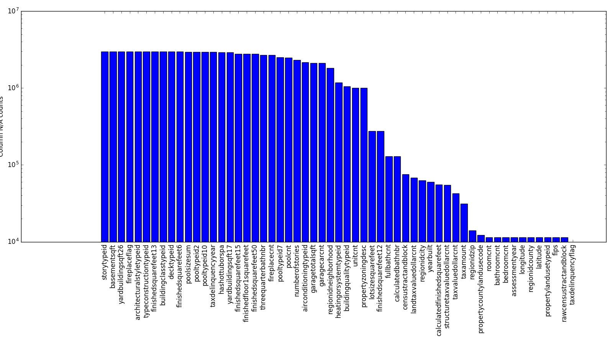
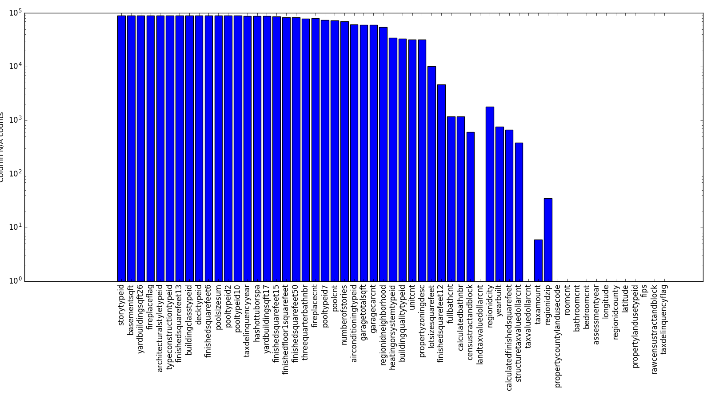
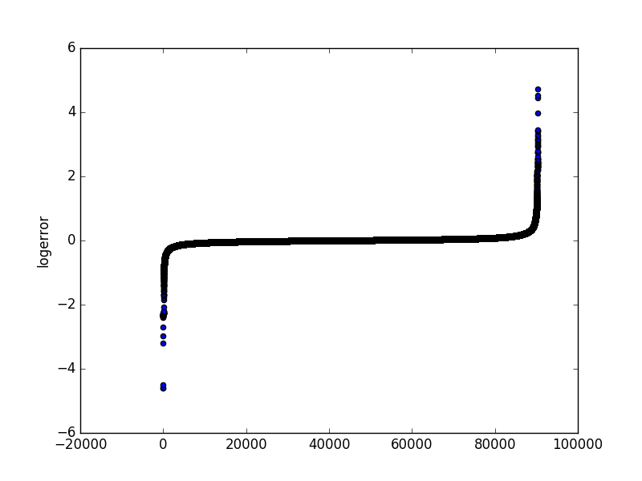
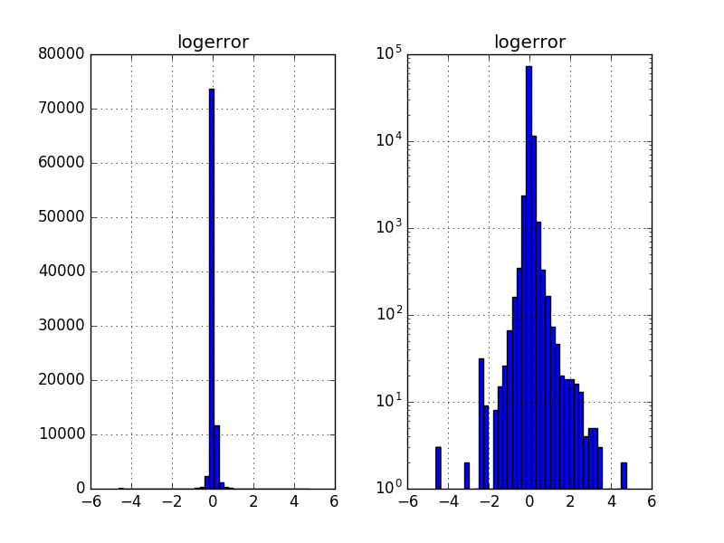
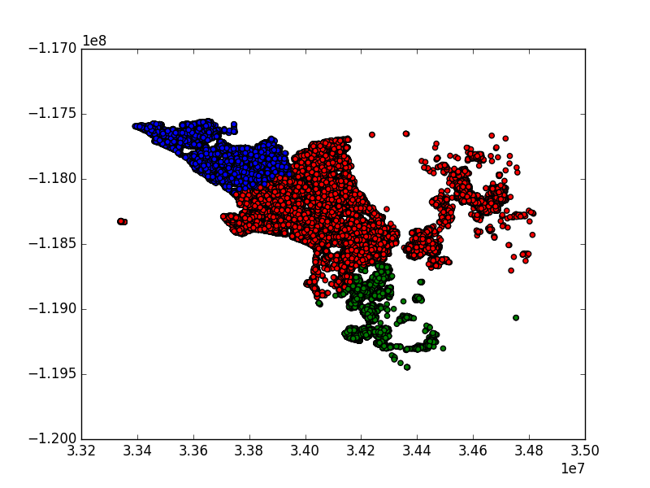
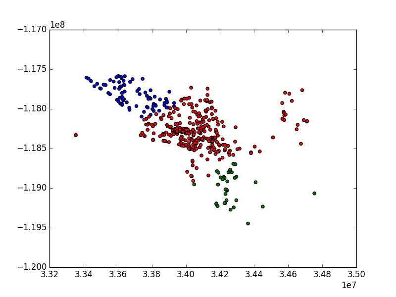

# Machine Learning Engineer Nanodegree
## Capstone Project
Mike DeLong

September 31st, 2017

## I. Definition

### Project Overview

For most people who own their house it will be one of the largest investment decisions they will ever make. Historically when a house is put up for sale the asking price is justified by looking at a handful of comparable properties, or "comparables," determined during the real estate appraisal process.

This initial asking price is essentially an anchor point for the sale of the house; the final sale price is sometimes higher than the initial asking price (in an especially tight market, where there are many buyers chasing relatively few houses), but more often the final sale price is lower, as time works against the seller in a number of ways, through the cost of continuing to owe money on the house, through the loss of liquidity from the seller not having the proceeds of the sale available, or because of preference of potential buyers for newly-listed properties.

The traditional five factors for determining a comparable are
* Conditions of sale
* Financing Conditions
* Market Conditions
* Locational comparability
* Physical comparability

These five factors are typically presented indirectly; instead the seller's agent presents MLS listings for a handful of properties and the reader is left to imagine what light they actually shed on the seller's property. When a potential buyer is looking at a package consisting of an asking price and a list of comparables it is difficult to see what impact each factor has on the asking price.

Comparables are also relatively illiquid: they do not tell us what the asking price would have been a year ago, or more importantly what a reasonable asking price would be a year from now.

One alternative to a short list of comparables is the Zillow Estimate (Zestimate), which uses a proprietary machine learning algorithm to estimate the final sale price based (mostly) on publicly available information. Of the five factors listed above, Zestimates focus mostly on locational and physical comparability. The assumption that we can depend entirely on public information will allow us to give an estimate for the sale price at any time, and the price should be fairly liquid, meaning that each time we update the model based on new information (e.g. tax assessments, sale prices) we can update the Zestimate.

It is worth noting that the Zestimate represents a big step forward in empowering buyers and sellers in what is generally an opaque and even frightening life experience, because Zestimates are available for any property, because they are fairly good predictions of the final sale price, and because they are available at no cost to the public.

The other factors listed above are not explicit in the available data: if we do not have explicit features for condition of sale, financing conditions, or market conditions then we are not explicitly capturing whatever they contribute to the sale price. It is open for discussion how and whether the source data for Zestimates capture these factors, or even if Zestimates do the same thing that comparables do.

Also, there are vagaries of the sales process that impact the final sale price that are very difficult to capture and will introduce noise (variance, or errors) into the model: e.g. how busy and therefore how engaged is the seller's agent; how motivated are the buyers and sellers; etc.

Given a set of inputs we are looking for the log-error (or the log-residual-error) of the Zestimate, which is the log-error is the log of the Zestimate minus the log of the actual sale price. This log-error will always be nonzero; over the lifetime of Zestimates Zillow has reduced the median margin of error from approximately 14% to approximately 5%.

Zillow is holding a contest on Kaggle to improve Zestimates; the contest consists of two rounds: a public round and a private round. Only the top 100 contestants from the public round will go through to the private round.

### Problem Statement
In this section, you will want to clearly define the problem that you are trying to solve, including the strategy (outline of tasks) you will use to achieve the desired solution. You should also thoroughly discuss what the intended solution will be for this problem. Questions to ask yourself when writing this section:
- _Is the problem statement clearly defined? Will the reader understand what you are expecting to solve?_
- _Have you thoroughly discussed how you will attempt to solve the problem?_
- _Is an anticipated solution clearly defined? Will the reader understand what results you are looking for?_

For the public round we will minimize the mean absolute error between the predicted log error and the actual log error: rather than predicting the house price we are predicting the error of the current model. We will predict the error for all available properties that sold in the last quarter of calendar year 2016.

Our dependent variable is continuous, so this is a regression problem. We have 58 input variables, a mix of real, integer, categorical, and Boolean (flag) variables.

To accomplish this we will
1. Combine the transaction data we have with the property data we have to build a training set
2. Investigate the data to see what sort of cleaning and transformation the data will need for the model to work effectively
3. Transform the data as appropriate
4. Build and train a model and predict the log-error for all of the properties in the test set
5. Build a submission file for entry in the Kaggle competition
6. Submit our file and verify that the results are an improvement over those from the baseline model
7. Explore model hyperparameters as appropriate

Our results quality will ultimately be based on the score we receive from Kaggle, which is based on log-error data for transactions we do not have; as a result we will not be able to observe the target result directly.

### Metrics

As stated above we will be calculating the log-error of the Zestimate; we will be attempting to minimize the mean absolute error ([MAE](https://www.kaggle.com/wiki/MeanAbsoluteError)) of the log-error, which is the mean of the absolute values of the difference between the predicted value and the Zestimate value. Alternatives here would be the mean squared error (MSE) or the root mean squared error ([RMSE](https://www.kaggle.com/wiki/RootMeanSquaredError)).

This choice was not open for us to make; the contest designers chose this error measure. This is a pretty reasonable choice however, because it represents a preference for minimizing the error at every point, by weighting each datapoint equally. The mean-squared error measures, by contrast, weight large errors more heavily.  

The competition frequently asked questions ([FAQ](https://www.kaggle.com/c/zillow-prize-1/discussion/33899)) discuss the choice of MAE over RMSE:
> Why did Zillow pick the log error instead of an absolute error metric such as RMSE?
Home sale prices have a right skewed distribution and are also strongly heteroscedastic, so we need to use a relative error metric instead of an absolute metric to ensure valuation models are not biased towards expensive homes. A relative error metric like the percentage error or log ratio error avoids these problems. While we report Zestimate errors in terms of percentages on Zillow.com because we believe that to be a more intuitive metric for consumers, we do not advocate using percentage error to evaluate models in Zillow Prize, as it may lead to biased models The log error is free of this bias problem and when using the natural logarithm, errors close to 1 approximate percentage errors quite closely. See [this paper](https://papers.ssrn.com/sol3/papers.cfm?abstract_id=2635088) for more on relative errors and why log error should be used instead of percentage error.

As mentioned above our real success or failure can be measured by the MAE of the log-error, which we cannot calculate directly because we do not have the Zestimates for all of the target properties.

## II. Analysis
Introductory text goes here.

### Data Exploration

We have two data files as input:
* A training set of properties and home features for 2016: 2985217 properties and 58 features.
* A training set of transactions for 2016: 90275 transactions, including sale prices and dates.

The properties are all from three counties in California: Los Angeles, Orange, and Ventura that sold in 2016. The training data has a full set of transactions (dates and prices) from before October 15, 2016 and some transactions after October 15, 2016.

The competition artifacts also include a data dictionary and a sample submission.

All of these files are available at the Zillow Prize data page: https://www.kaggle.com/c/zillow-prize-1/data

The raw or native features are as follows:

|Feature	|Description|
|---|---|
|airconditioningtypeid	 |Type of cooling system present in the home (if any)|
|architecturalstyletypeid	 |Architectural style of the home (i.e. ranch, colonial, split-level, etc…)|
|basementsqft	 |Finished living area below or partially below ground level|
|bathroomcnt	 |Number of bathrooms in home including fractional bathrooms|
|bedroomcnt	 |Number of bedrooms in home|
|buildingqualitytypeid	 |Overall assessment of condition of the building from best (lowest) to worst (highest)|
|buildingclasstypeid	|The building framing type (steel frame, wood frame, concrete/brick) |
|calculatedbathnbr	 |Number of bathrooms in home including fractional bathroom|
|decktypeid	|Type of deck (if any) present on parcel|
|threequarterbathnbr	 |Number of 3/4 bathrooms in house (shower + sink + toilet)|
|finishedfloor1squarefeet	 |Size of the finished living area on the first (entry) floor of the home|
|calculatedfinishedsquarefeet	 |Calculated total finished living area of the home |
|finishedsquarefeet6	|Base unfinished and finished area|
|finishedsquarefeet12	|Finished living area|
|finishedsquarefeet13	|Perimeter  living area|
|finishedsquarefeet15	|Total area|
|finishedsquarefeet50	 |Size of the finished living area on the first (entry) floor of the home|
|fips	 |Federal Information Processing Standard code |
|fireplacecnt	 |Number of fireplaces in a home (if any)|
|fireplaceflag	 |Is a fireplace present in this home? |
|fullbathcnt	 |Number of full bathrooms (sink, shower + bathtub, and toilet) present in home|
|garagecarcnt	 |Total number of garages on the lot including an attached garage|
|garagetotalsqft	 |Total number of square feet of all garages on lot including an attached garage|
|hashottuborspa	 |Does the home have a hot tub or spa|
|heatingorsystemtypeid	 |Type of home heating system|
|latitude	 |Latitude of the middle of the parcel multiplied by 1,000,000|
|longitude	 |Longitude of the middle of the parcel multiplied by 1,000,000|
|lotsizesquarefeet	 |Area of the lot in square feet|
|numberofstories	 |Number of stories or levels the home has|
|parcelid	 |Unique identifier for parcels (lots) |
|poolcnt	 |Number of pools on the lot (if any)|
|poolsizesum	 |Total square footage of all pools on property|
|pooltypeid10	 |Spa or Hot Tub|
|pooltypeid2	 |Pool with Spa/Hot Tub|
|pooltypeid7	 |Pool without hot tub|
|propertycountylandusecode	 |County land use code i.e. its zoning at the county level|
|propertylandusetypeid	 |Type of land use the property is zoned for|
|propertyzoningdesc	 |Description of the allowed land uses (zoning) for that property|
|rawcensustractandblock	 |Census tract and block ID combined - also contains blockgroup assignment by extension|
|censustractandblock	 |Census tract and block ID combined - also contains blockgroup assignment by extension|
|regionidcounty	|County in which the property is located|
|regionidcity	 |City in which the property is located (if any)|
|regionidzip	 |Zip code in which the property is located|
|regionidneighborhood	|Neighborhood in which the property is located|
|roomcnt	 |Total number of rooms in the principal residence|
|storytypeid	 |Type of floors in a multi-story house (i.e. basement and main level, split-level, attic, etc.).|  
|typeconstructiontypeid	 |What type of construction material was used to construct the home|
|unitcnt	 |Number of units the structure is built into (i.e. 2 = duplex, 3 = triplex, etc...)|
|yardbuildingsqft17	|Patio in  yard|
|yardbuildingsqft26	|Storage shed/building in yard|
|yearbuilt	 |The Year the principal residence was built |
|taxvaluedollarcnt	|The total tax assessed value of the parcel|
|structuretaxvaluedollarcnt	|The assessed value of the built structure on the parcel|
|landtaxvaluedollarcnt	|The assessed value of the land area of the parcel|
|taxamount	| The total property tax assessed for that assessment year|
|assessmentyear	| The year of the property tax assessment |
|taxdelinquencyflag	| Property taxes for this parcel are past due as of 2015|
|taxdelinquencyyear	| Year for which the unpaid property taxes were due |

The summary statistics for log-error look like this:
|name|value|
|---|---|
|count|    90275|
|mean|         0.011457|
|std|          0.161079|
|min|         -4.605|
|25%|         -0.0253|
|50% (median)|          0.006|
|75%|          0.0392|
|max|          4.737|

This suggests that the log-error is mostly clustered pretty tightly around the mean; also, the mean is greater than the median, so we have a little bit of positive skew.

Similarly the summary statistics for the total tax amount look like this:

|name|value|
|---|---:|
|count     |90269|
|mean       |5983.97|
|std        |6838.87|
|min          |49.08|
|25%        |2872.83|
|50% (median)       |4542.75|
|75%        |6901.09|
|max      |321936.09|

This suggests we have some positive skew and some (massive) outliers, meaning that we have a few very expensive houses.

We have one feature that takes on only one value (assessmentyear), and several that take on only two values, one of them being null. We should be able to model these as Booleans.

We have 58 independent variables, but we can put them in three broad qualitative categories:
1. Location data, which tells us where the house is
2. House intrinsic data, which tells us things about the structure, its features, or the lot on which it sits
3. Tax data, which tells us the tax assessment value, and where appropriate if the property is tax delinquent and if so which year it became delinquent

We also have a mix of features that are common, features that are rare, and some that are in between. The following table shows how often a particular feature is present, as a percent, in ascending order.

|column | percent not null|
|---:|---:|
|storytypeid | 0.05|
|basementsqft | 0.05|
|yardbuildingsqft26 | 0.09|
|fireplaceflag | 0.17|
|architecturalstyletypeid | 0.20|
|typeconstructiontypeid | 0.23|
|finishedsquarefeet13 | 0.26|
|buildingclasstypeid | 0.42|
|decktypeid | 0.57|
|finishedsquarefeet6 | 0.74|
|poolsizesum | 0.94|
|pooltypeid2 | 1.07|
|pooltypeid10 | 1.24|
|taxdelinquencyyear | 1.89|
|hashottuborspa | 2.31|
|yardbuildingsqft17 | 2.69|
|finishedsquarefeet15 | 6.39|
|finishedfloor1squarefeet | 6.79|
|finishedsquarefeet50 | 6.79|
|threequarterbathnbr | 10.44|
|fireplacecnt | 10.47|
|pooltypeid7 | 16.26|
|poolcnt | 17.34|
|numberofstories | 22.85|
|airconditioningtypeid | 27.18|
|garagetotalsqft | 29.59|
|garagecarcnt | 29.59|
|regionidneighborhood | 38.74|
|heatingorsystemtypeid | 60.51|
|buildingqualitytypeid | 64.94|
|unitcnt | 66.24|
|propertyzoningdesc | 66.28|
|lotsizesquarefeet | 90.75|
|finishedsquarefeet12 | 90.75|
|fullbathcnt | 95.68|
|calculatedbathnbr | 95.68|
|censustractandblock | 97.48|
|landtaxvaluedollarcnt | 97.73|
|regionidcity | 97.89|
|yearbuilt | 97.99|
|calculatedfinishedsquarefeet | 98.14|
|structuretaxvaluedollarcnt | 98.16|
|taxvaluedollarcnt | 98.57|
|taxamount | 98.95|
|regionidzip | 99.53|
|propertycountylandusecode | 99.59|
|roomcnt | 99.62|
|bathroomcnt | 99.62|
|bedroomcnt | 99.62|
|assessmentyear | 99.62|
|longitude | 99.62|
|regionidcounty | 99.62|
|latitude | 99.62|
|propertylandusetypeid | 99.62|
|fips | 99.62|
|rawcensustractandblock | 99.62|

This means we could probably build a regression model using only numerical data, but we want to leverage all the data we can. That means we need to deal with categorical and Boolean data as well.

We have some data that is obviously categorical, like the county land use code (which has 78 values) and the property zoning description (which has 1997 values) which are string values and need to be transformed to be usable in the model. For these we will need to use a label encoder to convert the strings to integers.

We also have some data that in its raw form looks like numerical data but that will need some transformation: in particular the year the property became tax delinquent is stored as a two-digit number, and some of the dates are in the Twentieth century, so we will need to transform them into a "number of years delinquent" to get them in the right order. We also have the FIPS/County ID, which is represented by a numerical value but is essentially a categorical value.

We also need to deal with missing values. We are choosing a model that will tolerate null values, but we want to impute values where possible. For e.g. the latitude and longitude we will assume that we can impute values using mean values.

Finally, most of the log-error values cluster around zero, but some are (relatively speaking) quite large. We will want to train the model without some number of outliers to avoid overfitting. We will choose these by ignoring cases with a log-error above some value without regard for other features of the property.

### Exploratory Visualization
We have three basic kinds of training data: location data, property intrinsic data, and tax-related data; and our target variable is the log-error.

#### Missing data
We would like to know what the distribution of missing data looks like. In particular we want to know if there are properties where we have a substantial number of cases where we have features that are always present in the training data but are missing in the test data. We do this by adding bar charts for the number of missing values (NAs) for each feature.

This first chart shows the counts for all the properties on a log scale. Not surprisingly we have essentially three kinds of features: features that are rare (to the left), features that are common (to the right), and features that are in between (in the middle).

Missing data for training data:

We have kept the columns in the same order, so it is relatively easy to see the differences in the distribution of missing data: in particular it is clear that we have more than ten features for which we have no missing data in the training data set, but we have a fair number of properties in the test data set that have this data missing.

This suggests that the training data is not entirely a representative sample of the test data, because we are missing some crucial data for some properties that we cannot infer. This means there is an unknown lower bound on how far we can reduce the error.

#### Error data
We already suspect from the discussion above that the log-error is mostly quite small; it is probably helpful to visualize the log-error to see what the distribution actually looks like.

We can do this in a couple of ways: as a scatter plot and as a histogram.

First we see that virtually all of the log-error values are near zero, and only a few are larger than about 0.1.

Here we see the distribution of the log-error on a linear and log scale. It is relatively easy to see that the overwhelming majority of the training data has small errors, with a few outliers, and that the log-error has just a little positive skew.

#### Location data

We have data from three counties: Los Angeles, Orange, and Ventura, and we have location data in the form of latitude and longitude data for each property in our training data. If we plot the latitude and longitude for each property in the training set and color the marker by the county we get a reasonable picture of the location of each property and the county in which it is located.

This shows us that we have some noise in the location data; in fact if we appear to have hundreds of properties in Los Angeles County (red markers) for which the locations are uncertain, to the extent that the model will think they are actually outside Los Angeles County.

We see the same noise in the test data:

We can think of this noise in one of three ways:
0. The FIPS data is correct and the latitude/longitude is incorrect
1. The FIPS data is incorrect and the latitude/longitude is correct
2. Both the FIPS data and the latitude/longitude are incorrect

With the current dataset we don't have a way to distinguish among these three cases. Regardless, because the training data and the test data are distributed similarly, we are inclined to leave the noisy data in the train/test sets.

Finally, we're especially interested in whether there is an obvious geographic component to the log-error outliers, so we take the properties with the most extreme 0.5% of the log-error values and map and color them as above:

For the most part they look like a small random sample of the data. This again suggests that we have errors in the data that we can't easily correct.

#### Property intrinsic data
In this section we will look at intrinsic properties of the property: lot sizes, house square feet, and room counts.

For the following graph we have bucketed the training data and we have used a log scale for the magnitude (y-axis) of each feature so we can easily see some breadth along the x-axis. We can see in each graph that we have a few outliers on the right end of the distribution: we have a handful of large to very large properties in our training data: e.g. we have at least one each of the following: a 25000 square foot house, a 700,000 square foot lot, a 16-bedroom house, and a house with 20 bathrooms.

The test data is even more skewed, especially the house and lot square feet. Also, we note that for the test data the right end of the bedroom and bathroom distribution is substantially thicker, meaning that we have a few hundred properties we will try to model on the basis of a handful of training cases.

#### Tax data
We really have two kinds of tax data: tax assessment data and tax delinquency data. We would expect these two groups of data to have different relationships to the house price:
* The tax assessment may be very predictive of the sale price, provided the assessment is updated frequently. In a county where tax assessments are updated only when houses are sold, it will be a trailing indicator rather than a leading indicator.
* Houses become tax delinquent for several reasons, but generally properties that are tax-delinquent will sell at a discount to the price they would have otherwise have brought.

We first look at the tax value and its components (land and structure) and the tax amount. These show the distributions we would expect based on the sizes and room counts above. We note briefly that while the tax amount is one to two cents on the dollar of tax value, the distributions are not identical, suggesting perhaps that tax rates are not entirely consistent across all properties in all counties.

For the test data we see that the same trends are apparent as before: there are more outliers, and they lie further to the right.

### Algorithms and Techniques
In this section, you will need to discuss the algorithms and techniques you intend to use for solving the problem. You should justify the use of each one based on the characteristics of the problem and the problem domain. Questions to ask yourself when writing this section:
- _Are the algorithms you will use, including any default variables/parameters in the project clearly defined?_
- _Are the techniques to be used thoroughly discussed and justified?_
- _Is it made clear how the input data or datasets will be handled by the algorithms and techniques chosen?_

We are using a gradient boosted random forest model called XGBoost. XGBoost is a general-purpose supervised learning method that uses gradient boosting and decision trees; it is also called a tree ensemble model. It was developed by Tianqi Chen and Carlos Guestrin at the University of Washington, and the original  [paper](https://arxiv.org/pdf/1603.02754.pdf) describing the model was published in June 2016.

1. Define the algorithm
2. Justify its use based on the characteristics of the problem and the problem domain
3. Include algorithm variables and parameters
4.

### Benchmark
In this section, you will need to provide a clearly defined benchmark result or threshold for comparing across performances obtained by your solution. The reasoning behind the benchmark (in the case where it is not an established result) should be discussed. Questions to ask yourself when writing this section:
- _Has some result or value been provided that acts as a benchmark for measuring performance?_
- _Is it clear how this result or value was obtained (whether by data or by hypothesis)?_

## III. Methodology
_(approx. 3-5 pages)_

### Data Preprocessing
In this section, all of your preprocessing steps will need to be clearly documented, if any were necessary. From the previous section, any of the abnormalities or characteristics that you identified about the dataset will be addressed and corrected here. Questions to ask yourself when writing this section:
- _If the algorithms chosen require preprocessing steps like feature selection or feature transformations, have they been properly documented?_
- _Based on the **Data Exploration** section, if there were abnormalities or characteristics that needed to be addressed, have they been properly corrected?_
- _If no preprocessing is needed, has it been made clear why?_

There are a lot of nulls in this data.
There is a lot of categorical data.
If we had just numerical data we could probably scale the data as appropriate and use a linear regression model.

The preprocessing steps are as follows:
1. Combine the transaction data in the training data with properties to get a complete set of labeled training data
1. Replace Nan values with zero as appropriate; anywhere this is unambiguous
2. Remove duplicate sales
3. Remove outliers in the training data
4. Do one train/predict cycle with the model to identify features that are not significant and remove these features.

We also need to transform the

### Implementation
In this section, the process for which metrics, algorithms, and techniques that you implemented for the given data will need to be clearly documented. It should be abundantly clear how the implementation was carried out, and discussion should be made regarding any complications that occurred during this process. Questions to ask yourself when writing this section:
- _Is it made clear how the algorithms and techniques were implemented with the given datasets or input data?_
- _Were there any complications with the original metrics or techniques that required changing prior to acquiring a solution?_
- _Was there any part of the coding process (e.g., writing complicated functions) that should be documented?_

### Refinement
In this section, you will need to discuss the process of improvement you made upon the algorithms and techniques you used in your implementation. For example, adjusting parameters for certain models to acquire improved solutions would fall under the refinement category. Your initial and final solutions should be reported, as well as any significant intermediate results as necessary. Questions to ask yourself when writing this section:
- _Has an initial solution been found and clearly reported?_
- _Is the process of improvement clearly documented, such as what techniques were used?_
- _Are intermediate and final solutions clearly reported as the process is improved?_

## IV. Results
_(approx. 2-3 pages)_

### Model Evaluation and Validation
In this section, the final model and any supporting qualities should be evaluated in detail. It should be clear how the final model was derived and why this model was chosen. In addition, some type of analysis should be used to validate the robustness of this model and its solution, such as manipulating the input data or environment to see how the model’s solution is affected (this is called sensitivity analysis). Questions to ask yourself when writing this section:
- _Is the final model reasonable and aligning with solution expectations? Are the final parameters of the model appropriate?_
- _Has the final model been tested with various inputs to evaluate whether the model generalizes well to unseen data?_
- _Is the model robust enough for the problem? Do small perturbations (changes) in training data or the input space greatly affect the results?_
- _Can results found from the model be trusted?_

### Justification
In this section, your model’s final solution and its results should be compared to the benchmark you established earlier in the project using some type of statistical analysis. You should also justify whether these results and the solution are significant enough to have solved the problem posed in the project. Questions to ask yourself when writing this section:
- _Are the final results found stronger than the benchmark result reported earlier?_
- _Have you thoroughly analyzed and discussed the final solution?_
- _Is the final solution significant enough to have solved the problem?_

## V. Conclusion
_(approx. 1-2 pages)_

### Free-Form Visualization
In this section, you will need to provide some form of visualization that emphasizes an important quality about the project. It is much more free-form, but should reasonably support a significant result or characteristic about the problem that you want to discuss. Questions to ask yourself when writing this section:
- _Have you visualized a relevant or important quality about the problem, dataset, input data, or results?_
- _Is the visualization thoroughly analyzed and discussed?_
- _If a plot is provided, are the axes, title, and datum clearly defined?_

### Reflection
In this section, you will summarize the entire end-to-end problem solution and discuss one or two particular aspects of the project you found interesting or difficult. You are expected to reflect on the project as a whole to show that you have a firm understanding of the entire process employed in your work. Questions to ask yourself when writing this section:
- _Have you thoroughly summarized the entire process you used for this project?_
- _Were there any interesting aspects of the project?_
- _Were there any difficult aspects of the project?_
- _Does the final model and solution fit your expectations for the problem, and should it be used in a general setting to solve these types of problems?_

### Improvement
In this section, you will need to provide discussion as to how one aspect of the implementation you designed could be improved. As an example, consider ways your implementation can be made more general, and what would need to be modified. You do not need to make this improvement, but the potential solutions resulting from these changes are considered and compared/contrasted to your current solution. Questions to ask yourself when writing this section:
- _Are there further improvements that could be made on the algorithms or techniques you used in this project?_
- _Were there algorithms or techniques you researched that you did not know how to implement, but would consider using if you knew how?_
- _If you used your final solution as the new benchmark, do you think an even better solution exists?_

-----------

**Before submitting, ask yourself. . .**

- Does the project report you’ve written follow a well-organized structure similar to that of the project template?
- Is each section (particularly **Analysis** and **Methodology**) written in a clear, concise and specific fashion? Are there any ambiguous terms or phrases that need clarification?
- Would the intended audience of your project be able to understand your analysis, methods, and results?
- Have you properly proof-read your project report to assure there are minimal grammatical and spelling mistakes?
- Are all the resources used for this project correctly cited and referenced?
- Is the code that implements your solution easily readable and properly commented?
- Does the code execute without error and produce results similar to those reported?
