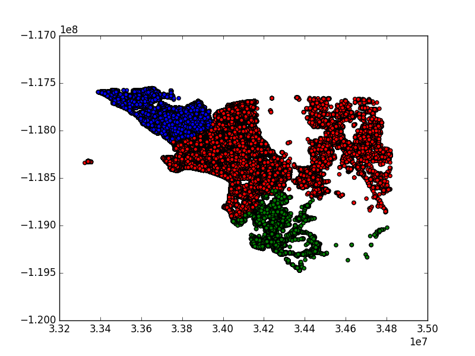

# Machine Learning Engineer Nanodegree
## Capstone Project
Mike DeLong

October 41st, 2017

## I. Definition

### Project Overview

For most people who own their house it will be one of the largest investment decisions they will ever make. Historically when a house is put up for sale the asking price is justified by looking at a handful of comparable properties, or "comparables," determined during the real estate appraisal process.

This initial asking price is essentially an anchor point for the sale of the house; the final sale price is sometimes higher than the initial asking price (in an especially tight market, where there are many buyers chasing relatively few houses), but more often the final sale price is lower, as time works against the seller in a number of ways, through the cost of continuing to owe money on the house, through the loss of liquidity from the seller not having the proceeds of the sale available, or because of preference of potential buyers for newly-listed properties.

The traditional five factors for determining a comparable are
* Conditions of sale
* Financing Conditions
* Market Conditions
* Locational comparability
* Physical comparability

These five factors are typically presented indirectly; instead the seller's agent presents MLS listings for a handful of properties and the reader is left to imagine what light they actually shed on the seller's property. When a potential buyer is looking at a package consisting of an asking price and a list of comparables it is difficult to see what impact each factor has on the asking price.

Comparables are also relatively illiquid: they do not tell us what the asking price would have been a year ago, or more importantly what a reasonable asking price would be a year from now.

One alternative to a short list of comparables is the Zillow Estimate (Zestimate), which uses a proprietary machine learning algorithm to estimate the final sale price based (mostly) on publicly available information. Of the five factors listed above, Zestimates focus mostly on locational and physical comparability. The assumption that we can depend entirely on public information will allow us to give an estimate for the sale price at any time, and the price should be fairly liquid, meaning that each time we update the model based on new information (e.g. tax assessments, sale prices) we can update the Zestimate.

It is worth noting that the Zestimate represents a big step forward in empowering buyers and sellers in what is generally an opaque and even frightening life experience, because Zestimates are available for any property, because they are fairly good predictions of the final sale price, and because they are available at no cost to the public.

The other factors listed above are not explicit in the available data: if we do not have explicit features for condition of sale, financing conditions, or market conditions then we are not explicitly capturing whatever they contribute to the sale price. It is open for discussion how and whether the source data for Zestimates capture these factors, or even if Zestimates do the same thing that comparables do.

Also, there are vagaries of the sales process that impact the final sale price that are very difficult to capture and will introduce noise (variance, or errors) into the model: e.g. how busy and therefore how engaged is the seller's agent; how motivated are the buyers and sellers; etc.

Given a set of inputs we are looking for the log-error (or the log-residual-error) of the Zestimate, which is the log-error is the log of the Zestimate minus the log of the actual sale price. This log-error will always be nonzero; over the lifetime of Zestimates Zillow has reduced the median margin of error from approximately 14% to approximately 5%.

Zillow is holding a contest on Kaggle to improve Zestimates; the contest consists of two rounds: a public round and a private round. Only the top 100 contestants from the public round will go through to the private round.

### Problem Statement

For the public round we will minimize the mean absolute error between the predicted log error and the actual log error: rather than predicting the house price we are predicting the error of the current model. We will predict the error for all available properties that sold in the last quarter of calendar year 2016.

Our dependent variable is continuous, so this is a regression problem. We have 58 input variables, a mix of real, integer, categorical, and Boolean (flag) variables.

To accomplish this we will
1. Combine the transaction data we have with the property data we have to build a training set
2. Investigate the data to see what sort of cleaning and transformation the data will need for the model to work effectively
3. Transform the data as appropriate
4. Build and train a model and predict the log-error for all of the properties in the test set
5. Build a submission file for entry in the Kaggle competition
6. Submit our file and verify that the results are an improvement over those from the baseline model
7. Explore model hyperparameters as appropriate

Our results quality will ultimately be based on the score we receive from Kaggle, which is based on log-error data for transactions we do not have; as a result we will not be able to observe the target result directly.

### Metrics

As stated above we will be calculating the log-error of the Zestimate; we will be attempting to minimize the mean absolute error ([MAE](https://www.kaggle.com/wiki/MeanAbsoluteError)) of the log-error, which is the mean of the absolute values of the difference between the predicted value and the Zestimate value. Alternatives here would be the mean squared error (MSE) or the root mean squared error ([RMSE](https://www.kaggle.com/wiki/RootMeanSquaredError)).

This choice was not open for us to make; the contest designers chose this error measure. This is a pretty reasonable choice however, because it represents a preference for minimizing the error at every point, by weighting each datapoint equally. The mean-squared error measures, by contrast, weight large errors more heavily.  

The competition frequently asked questions ([FAQ](https://www.kaggle.com/c/zillow-prize-1/discussion/33899)) discuss the choice of MAE over RMSE:
> Why did Zillow pick the log error instead of an absolute error metric such as RMSE?
Home sale prices have a right skewed distribution and are also strongly heteroscedastic, so we need to use a relative error metric instead of an absolute metric to ensure valuation models are not biased towards expensive homes. A relative error metric like the percentage error or log ratio error avoids these problems. While we report Zestimate errors in terms of percentages on Zillow.com because we believe that to be a more intuitive metric for consumers, we do not advocate using percentage error to evaluate models in Zillow Prize, as it may lead to biased models The log error is free of this bias problem and when using the natural logarithm, errors close to 1 approximate percentage errors quite closely. See [this paper](https://papers.ssrn.com/sol3/papers.cfm?abstract_id=2635088) for more on relative errors and why log error should be used instead of percentage error.

As mentioned above our real success or failure can be measured by the MAE of the log-error, which we cannot calculate directly because we do not have the Zestimates for all of the target properties.

## II. Analysis
Introductory text goes here.

### Data Exploration

We have two data files as input:
* A training set of properties and home features for 2016: 2985217 properties and 58 features.
* A training set of transactions for 2016: 90275 transactions, including sale prices and dates.

The properties are all from three counties in California: Los Angeles, Orange, and Ventura that sold in 2016. The training data has a full set of transactions (dates and prices) from before October 15, 2016 and some transactions after October 15, 2016.

The competition artifacts also include a data dictionary and a sample submission.

All of these files are available at the Zillow Prize data page: https://www.kaggle.com/c/zillow-prize-1/data

The raw or native features are as follows:

|Feature	|Description|
|---|---|
|airconditioningtypeid	 |Type of cooling system present in the home (if any)|
|architecturalstyletypeid	 |Architectural style of the home (i.e. ranch, colonial, split-level, etc…)|
|basementsqft	 |Finished living area below or partially below ground level|
|bathroomcnt	 |Number of bathrooms in home including fractional bathrooms|
|bedroomcnt	 |Number of bedrooms in home|
|buildingqualitytypeid	 |Overall assessment of condition of the building from best (lowest) to worst (highest)|
|buildingclasstypeid	|The building framing type (steel frame, wood frame, concrete/brick) |
|calculatedbathnbr	 |Number of bathrooms in home including fractional bathroom|
|decktypeid	|Type of deck (if any) present on parcel|
|threequarterbathnbr	 |Number of 3/4 bathrooms in house (shower + sink + toilet)|
|finishedfloor1squarefeet	 |Size of the finished living area on the first (entry) floor of the home|
|calculatedfinishedsquarefeet	 |Calculated total finished living area of the home |
|finishedsquarefeet6	|Base unfinished and finished area|
|finishedsquarefeet12	|Finished living area|
|finishedsquarefeet13	|Perimeter  living area|
|finishedsquarefeet15	|Total area|
|finishedsquarefeet50	 |Size of the finished living area on the first (entry) floor of the home|
|fips	 |Federal Information Processing Standard code |
|fireplacecnt	 |Number of fireplaces in a home (if any)|
|fireplaceflag	 |Is a fireplace present in this home? |
|fullbathcnt	 |Number of full bathrooms (sink, shower + bathtub, and toilet) present in home|
|garagecarcnt	 |Total number of garages on the lot including an attached garage|
|garagetotalsqft	 |Total number of square feet of all garages on lot including an attached garage|
|hashottuborspa	 |Does the home have a hot tub or spa|
|heatingorsystemtypeid	 |Type of home heating system|
|latitude	 |Latitude of the middle of the parcel multiplied by 1,000,000|
|longitude	 |Longitude of the middle of the parcel multiplied by 1,000,000|
|lotsizesquarefeet	 |Area of the lot in square feet|
|numberofstories	 |Number of stories or levels the home has|
|parcelid	 |Unique identifier for parcels (lots) |
|poolcnt	 |Number of pools on the lot (if any)|
|poolsizesum	 |Total square footage of all pools on property|
|pooltypeid10	 |Spa or Hot Tub|
|pooltypeid2	 |Pool with Spa/Hot Tub|
|pooltypeid7	 |Pool without hot tub|
|propertycountylandusecode	 |County land use code i.e. its zoning at the county level|
|propertylandusetypeid	 |Type of land use the property is zoned for|
|propertyzoningdesc	 |Description of the allowed land uses (zoning) for that property|
|rawcensustractandblock	 |Census tract and block ID combined - also contains blockgroup assignment by extension|
|censustractandblock	 |Census tract and block ID combined - also contains blockgroup assignment by extension|
|regionidcounty	|County in which the property is located|
|regionidcity	 |City in which the property is located (if any)|
|regionidzip	 |Zip code in which the property is located|
|regionidneighborhood	|Neighborhood in which the property is located|
|roomcnt	 |Total number of rooms in the principal residence|
|storytypeid	 |Type of floors in a multi-story house (i.e. basement and main level, split-level, attic, etc.).|  
|typeconstructiontypeid	 |What type of construction material was used to construct the home|
|unitcnt	 |Number of units the structure is built into (i.e. 2 = duplex, 3 = triplex, etc...)|
|yardbuildingsqft17	|Patio in  yard|
|yardbuildingsqft26	|Storage shed/building in yard|
|yearbuilt	 |The Year the principal residence was built |
|taxvaluedollarcnt	|The total tax assessed value of the parcel|
|structuretaxvaluedollarcnt	|The assessed value of the built structure on the parcel|
|landtaxvaluedollarcnt	|The assessed value of the land area of the parcel|
|taxamount	| The total property tax assessed for that assessment year|
|assessmentyear	| The year of the property tax assessment |
|taxdelinquencyflag	| Property taxes for this parcel are past due as of 2015|
|taxdelinquencyyear	| Year for which the unpaid property taxes were due |

The summary statistics for log-error look like this:
|name|value|
|---|---|
|count|    90275|
|mean|         0.011457|
|std|          0.161079|
|min|         -4.605|
|25%|         -0.0253|
|50% (median)|          0.006|
|75%|          0.0392|
|max|          4.737|

This suggests that the log-error is mostly clustered pretty tightly around the mean; also, the mean is greater than the median, so we have a little bit of positive skew.

Similarly the summary statistics for the total tax amount look like this:

|name|value|
|---|---:|
|count     |90269|
|mean       |5983.97|
|std        |6838.87|
|min          |49.08|
|25%        |2872.83|
|50% (median)       |4542.75|
|75%        |6901.09|
|max      |321936.09|

This suggests we have some positive skew and some (massive) outliers, meaning that we have a few very expensive houses.

We have one feature that takes on only one value (assessmentyear), and several that take on only two values, one of them being null. We should be able to model these as Booleans.

We have 58 independent variables, but we can put them in three broad qualitative categories:
1. Location data, which tells us where the house is
2. House intrinsic data, which tells us things about the structure, its features, or the lot on which it sits
3. Tax data, which tells us the tax assessment value, and where appropriate if the property is tax delinquent and if so which year it became delinquent

We also have a mix of features that are common, features that are rare, and some that are in between. The following table shows how often a particular feature is present, as a percent, in ascending order.

|column | percent not null|
|---:|---:|
|storytypeid | 0.05|
|basementsqft | 0.05|
|yardbuildingsqft26 | 0.09|
|fireplaceflag | 0.17|
|architecturalstyletypeid | 0.20|
|typeconstructiontypeid | 0.23|
|finishedsquarefeet13 | 0.26|
|buildingclasstypeid | 0.42|
|decktypeid | 0.57|
|finishedsquarefeet6 | 0.74|
|poolsizesum | 0.94|
|pooltypeid2 | 1.07|
|pooltypeid10 | 1.24|
|taxdelinquencyyear | 1.89|
|hashottuborspa | 2.31|
|yardbuildingsqft17 | 2.69|
|finishedsquarefeet15 | 6.39|
|finishedfloor1squarefeet | 6.79|
|finishedsquarefeet50 | 6.79|
|threequarterbathnbr | 10.44|
|fireplacecnt | 10.47|
|pooltypeid7 | 16.26|
|poolcnt | 17.34|
|numberofstories | 22.85|
|airconditioningtypeid | 27.18|
|garagetotalsqft | 29.59|
|garagecarcnt | 29.59|
|regionidneighborhood | 38.74|
|heatingorsystemtypeid | 60.51|
|buildingqualitytypeid | 64.94|
|unitcnt | 66.24|
|propertyzoningdesc | 66.28|
|lotsizesquarefeet | 90.75|
|finishedsquarefeet12 | 90.75|
|fullbathcnt | 95.68|
|calculatedbathnbr | 95.68|
|censustractandblock | 97.48|
|landtaxvaluedollarcnt | 97.73|
|regionidcity | 97.89|
|yearbuilt | 97.99|
|calculatedfinishedsquarefeet | 98.14|
|structuretaxvaluedollarcnt | 98.16|
|taxvaluedollarcnt | 98.57|
|taxamount | 98.95|
|regionidzip | 99.53|
|propertycountylandusecode | 99.59|
|roomcnt | 99.62|
|bathroomcnt | 99.62|
|bedroomcnt | 99.62|
|assessmentyear | 99.62|
|longitude | 99.62|
|regionidcounty | 99.62|
|latitude | 99.62|
|propertylandusetypeid | 99.62|
|fips | 99.62|
|rawcensustractandblock | 99.62|

This means we could probably build a regression model using only numerical data, but we want to leverage all the data we can. That means we need to deal with categorical and Boolean data as well.

We have some data that is obviously categorical, like the county land use code (which has 78 values) and the property zoning description (which has 1997 values) which are string values and need to be transformed to be usable in the model. For these we will need to use a label encoder to convert the strings to integers.

We also have some data that in its raw form looks like numerical data but that will need some transformation: in particular the year the property became tax delinquent is stored as a two-digit number, and some of the dates are in the Twentieth century, so we will need to transform them into a "number of years delinquent" to get them in the right order. We also have the FIPS/County ID, which is represented by a numerical value but is essentially a categorical value.

We also need to deal with missing values. We are choosing a model that will tolerate null values, but we want to impute values where possible. For e.g. the latitude and longitude we will assume that we can impute values using mean values.

Finally, most of the log-error values cluster around zero, but some are (relatively speaking) quite large. We will want to train the model without some number of outliers to avoid overfitting. We will choose these by ignoring cases with a log-error above some value without regard for other features of the property.

### Exploratory Visualization
We have three basic kinds of training data: location data, property intrinsic data, and tax-related data; and our target variable is the log-error.

#### Missing data
We would like to know what the distribution of missing data looks like. In particular we want to know if there are properties where we have a substantial number of cases where we have features that are always present in the training data but are missing in the test data. We do this by adding bar charts for the number of missing values (NAs) for each feature.

This first chart shows the counts for all the properties on a log scale. Not surprisingly we have essentially three kinds of features: features that are rare (to the left), features that are common (to the right), and features that are in between (in the middle).

Missing data for training data:

We have kept the columns in the same order, so it is relatively easy to see the differences in the distribution of missing data: in particular it is clear that we have more than ten features for which we have no missing data in the training data set, but we have a fair number of properties in the test data set that have this data missing.

This suggests that the training data is not entirely a representative sample of the test data, because we are missing some crucial data for some properties that we cannot infer. This means there is an unknown lower bound on how far we can reduce the error.

#### Error data
We already suspect from the discussion above that the log-error is mostly quite small; it is probably helpful to visualize the log-error to see what the distribution actually looks like.

We can do this in a couple of ways: as a scatter plot and as a histogram.

First we see that virtually all of the log-error values are near zero, and only a few are larger than about 0.1.

Here we see the distribution of the log-error on a linear and log scale. It is relatively easy to see that the overwhelming majority of the training data has small errors, with a few outliers, and that the log-error has just a little positive skew.

#### Location data

We have data from three counties: Los Angeles, Orange, and Ventura, and we have location data in the form of latitude and longitude data for each property in our training data. If we plot the latitude and longitude for each property in the training set and color the marker by the county we get a reasonable picture of the location of each property and the county in which it is located.

This shows us that we have some noise in the location data; in fact if we appear to have hundreds of properties in Los Angeles County (red markers) for which the locations are uncertain, to the extent that the model will think they are actually outside Los Angeles County.

We see the same noise in the test data:

We can think of this noise in one of three ways:
0. The FIPS data is correct and the latitude/longitude is incorrect
1. The FIPS data is incorrect and the latitude/longitude is correct
2. Both the FIPS data and the latitude/longitude are incorrect

With the current dataset we don't have a way to distinguish among these three cases. Regardless, because the training data and the test data are distributed similarly, we are inclined to leave the noisy data in the train/test sets.

Finally, we're especially interested in whether there is an obvious geographic component to the log-error outliers, so we take the properties with the most extreme 0.5% of the log-error values and map and color them as above:

For the most part they look like a small random sample of the data. This again suggests that we have errors in the data that we can't easily correct.

#### Property intrinsic data
In this section we will look at intrinsic properties of the property: lot sizes, house square feet, and room counts.

For the following graph we have bucketed the training data and we have used a log scale for the magnitude (y-axis) of each feature so we can easily see some breadth along the x-axis. We can see in each graph that we have a few outliers on the right end of the distribution: we have a handful of large to very large properties in our training data: e.g. we have at least one each of the following: a 25000 square foot house, a 700,000 square foot lot, a 16-bedroom house, and a house with 20 bathrooms.

The test data is even more skewed, especially the house and lot square feet. Also, we note that for the test data the right end of the bedroom and bathroom distribution is substantially thicker, meaning that we have a few hundred properties we will try to model on the basis of a handful of training cases.

#### Tax data
We really have two kinds of tax data: tax assessment data and tax delinquency data. We would expect these two groups of data to have different relationships to the house price:
* The tax assessment may be very predictive of the sale price, provided the assessment is updated frequently. In a county where tax assessments are updated only when houses are sold, it will be a trailing indicator rather than a leading indicator.
* Houses become tax delinquent for several reasons, but generally properties that are tax-delinquent will sell at a discount to the price they would have otherwise have brought.

We first look at the tax value and its components (land and structure) and the tax amount. These show the distributions we would expect based on the sizes and room counts above. We note briefly that while the tax amount is one to two cents on the dollar of tax value, the distributions are not identical, suggesting perhaps that tax rates are not entirely consistent across all properties in all counties.

For the test data we see that the same trends are apparent as before: there are more outliers, and they lie further to the right.

We also want to look at the age of the houses being sold; we do not expect a strong correlation between the age of the house and the log-error, except possibly that very old houses will be difficult to model. We know that roughly 1% of housing stock is torn down every year, so any house older than about 70 years will not have a lot of comparables.

We see here that the distributions are roughly similar, with there being a few very old houses in the test data.

Next we want to take a look at properties that are tax delinquent. As mentioned before we expect these to be in poor repair and sell at a discount to the good-repair price. What we see is that in the training data almost all of the properties that are tax delinquent have become delinquent since the start of the credit crisis in 2007-2008. However in the test data we also have a few houses that have been delinquent for more than 30 years.

Regardless there are relatively few properties that are delinquent in aggregate. We might expect that the impact of tax delinquency would be very small, but probably not negligible.

### Algorithms and Techniques

We are using a gradient tree boosting model called XGBoost. XGBoost is a general-purpose model   developed by Tianqi Chen and Carlos Guestrin at the University of Washington, and the original  [paper](https://arxiv.org/pdf/1603.02754.pdf) describing the model was published in June 2016.

It is attractive for our case because
- It has both regression and classification flavors, and we need to solve a regression problem
- It can handle a mix of data types, including Boolean, integer, and real-valued data
- It can handle missing data; and
- It can handle sparse data.

It is also attractive relative to some alternatives in that the model can identify the relative feature importance for input features, making results relatively easy to interpret.

XGBoost is a tree ensemble model; the trees are classification and regression (CART) trees. The training uses an objective function consisting of a loss function (which we will try to minimize) and a regularization. In our case the loss function is MAE as described above, and the regularization is to be determined empirically. Training proceeds by splitting each tree and scoring the resulting split iteratively until some exit criteria are satisfied.

The model takes the parameters shown in the following table:
|Parameter   |Meaning   |
|---|---|
|alpha| An L1 regularization on the weights; defaults to zero. |
|base score   |  The initial score; a kind of bias. We set this to be the mean of the log errors in an attempt to improve on the baseline model described above. |
|booster   | Our choice of gradient boosting algorithm; the choices are "gbtree", "gblinear" or "dart". After some experimentation we settled on the default, "gbtree."|
|eta   | The step size shrinkage; used to prevent overfitting. Also known as the learning rate.  |
|evaluation metric   | The metric the model will use for the objective function for the validation data. For our purposes this is "mae", for the mean absolute error.  |
|gamma   | The minimum loss reduction required for the model to make a further partition on a leaf node of a tree. The larger gamma is the more conservative the model will be.  |
|lambda   | An L2 regularization term on weights, increase this value will make model more conservative; defaults to 1.0.  |
|max depth   | The maximum depth of a tree. Increasing this value will make the model more complex and likely to be prone to overfitting; defaults to 6.  |
|objective   | The learning objective. For regression our choices are linear, logistic, gamma (for outcomes that are expected to come from a gamma distribution), and Tweedie (for outcomes from a Tweedie distribution).  |
|random seed   | a seed for the random number generator; setting this will allow us to get reproducible results from the model  |
|subsample   |  This is the subsample ratio of the training instance; it determines how much of the instances will grow trees. Defaults to 1.0 (all instances grow trees). |

### Benchmark

Our benchmark model is very simple; we just take the arithmetic mean of the log error for the training data and use it for the log error of the test data. This gets a score of 0.0651282, which puts us above the mean on the current leader board.

It is not entirely surprising that we would do well with a constant model given that we are modeling the log error of the Zestimate, which we would expect to be close to zero most of the time, or how tightly the log error clusters for the test data.

## III. Methodology

In this section we discuss the methodology to build and refine a predictive model using XGBoost for the data we have available from Zillow for three California counties for 2016.

### Data Preprocessing

In order to use XGBoost with this data we will need to do a fair amount of preprocessing. The preprocessing steps are as follows:
1. Combine the transaction data in the training data with properties to get a complete set of labeled training data
1. Deal with missing values as appropriate
3. Remove outliers in the training data
4. Transform (log-transform) some features that have lots of skew
5. Deal with categorical data so it is properly represented
5. Do a train/predict cycle with the model to identify features that are not significant and remove these features.

The first step is required to have training data; steps two through five are intended to improve the model accuracy; the final step is intended to improve the model runtime.

### Implementation

The initial solution was fairly straightforward: we needed to build the training data from the available artifacts, clean the data, build the model from the data, predict the result for the full data, and create the output artifacts: the contest submission and the feature importance graph.

Our data load and cleaning approach proceeded as follows:
1. Load the known transactions and the property descriptions as pandas dataframes
2. As part of the property load we transformed some features to suppress some dataframe load warnings:
    1. We transformed features 'fireplaceflag', 'hashottuborspa', and 'taxdelinquencyflag' as Booleans
    2. We transformed features 'propertycountylandusecode' and 'propertyzoningdesc' as  strings
3. We joined the property and transaction data on the parcel ID to get a full set of training data, meaning data that has both features and results
4. We dropped the parcel ID and log-error columns from the training data to avoid training on a feature that we know is not significant (the parcel ID) and on the result data (the log-error).
5. We transformed some of the features that have numerical data:
    1. We transformed features 'calculatedfinishedsquarefeet', 'landtaxvaluedollarcnt', 'structuretaxvaluedollarcnt', 'taxamount', 'taxvaluedollarcnt' using a log transform. We did this because of skew in the original data; the log-transformed data has rather less skew
    2. We transformed the feature 'taxdelinquencyyear' from two-digit years to four-digit years. We did this because there were some properties in the training data that had become tax delinquent prior to 2000, so simply treating the two-digit years as training data would be inconsistent
    3. We transformed the latitude and longitude using a min-max scaling. The latitude and longitude as presented in the raw data were fractional degrees multiplied by one million; we did this scaling in an attempt to get the data to more accurately represent the relative differences in the datapoints.
6. We filled in missing values for various Boolean values, assuming that missing values are False.
7. We used a label encoder to transform string features to integers, filling in a bogus value for missing values. We did this for four features: 'fips', 'propertycountylandusecode', 'propertyzoningdesc',  and  'regionidzip'

Once we have the data ready we can create and train the model. The model needs several parameters as described above; we can get reasonable results from the model using the default values for most of the model parameters, with the following exceptions:
- base score: for this we will take the mean of the log-error values for the training data
- number of boost rounds: we need to decide how many rounds to run; this is something we will need to figure out through trial and error
- early stopping rounds: the XGBoost model will optionally quit early if it makes no progress after some number of rounds; this too we will need to figure out through trial and error

We will do some careful grid search to refine the parameters we use for the model. Because XGBoost has so many parameters we need to proceed carefully.

If we start with this model with the default values for almost all of the parameters (the exception being the base rate) we get a score 0.0647969, which is an improvement over our baseline model. The rest of the progress we will make by tuning the model.

### Refinement

As stated above, we started with the default values for all of the parameters except the base score and the evaluation metric (we started with MAE instead of RMSE). This was mostly an accidental result of having gotten data flowing through XGBoost and producing results. Once that was working and we were able to build a submission file and get a score from Kaggle we needed to start refining the model.

In an ideal situation we would have one or the other of the following conditions:
1. We would have direct access to the Zillow results so we could measure the log-error ourselves
2. We could submit as many solutions for scoring as needed

If either of these were the case we would use a grid search or, if we had good reason to believe that the error was more or less monotonic and had no local minima we could use a bisection method to find the best value for each parameter.

However this is not the case, so we can only try regions of the parameter space one at a time and assume that the error is more or less monotonic and there are no local minima. For real-valued parameters this certainly seems to be the case. For example if we choose lambda to be 1.0 and increase it gradually in increments of 0.01 we see that the score improves until lambda reaches 1.05, but it declines after that.

We took this approach with the following real-valued parameters:
- alpha
- eta
- gamma
- lambda
- subsample

And also with the integer-valued parameter
- max depth

In addition we tried different choices for the booster, the evaluation metric, and the objective function.

We did not try different values for the base score (it was always the mean of the log-error for the properties in the training data) or for the random seed.

Finally, in addition to tuning the model parameters we looked at the feature significance and dropped features that did not appear in the model significance. This reduced the number of features from 57 to 51.

## IV. Results

In this section we discuss the final model, its results, and discuss sensitivity analysis.

### Model Evaluation and Validation

Our final model has the following settings:

|Parameter   |Value   |
|---|---|
|alpha| 0 |
|base score   |  0.01095089 |
|booster   | gbtree  |
|eta   | 0.025  |
|evaluation metric   | mae  |
|gamma   | 0  |
|lambda   |1.05   |
|max depth   | 7  |
|objective   | reg:linear  |
|subsample   | 0.7   |

And this gives us a score of 0.0645313, which of the day of writing has us ranked 1395th out of 3686 entrants on the public leaderboard, or in the top 38%. In addition our feature significance looks like this:

To a first approximation the feature significance corresponds roughly to the availability of the data: features that are typically missing do not contribute much to the log-error. Also, we see that the most important (say, the top ten) features draw significantly from the three categories we outlined earlier:
- Property intrinsic features: finished square feet, lot size, year built, bathroom count, and building quality  
- Location features: latitude and longitude
- Tax-related features: the structure and land tax value and the total tax value

We might argue that in a production setting we would be willing to trade off some accuracy for simplicity, and we might drop the lowest ten to fifteen features; we would expect this to make the model more stable. If we were to go beyond the present competition to look at improving the Zillow model we would expect that our time would be better spent digging into the sensitivity of the log-error to the square feet, the structure tax value, or the latitude and longitude, rather than paying more attention to the FIPS code or whether the property includes a hot tub.

In our case we only include the least significant features because we empirically verified that leaving them out reduced our score by tiny amounts. In a similar situation in a production environment we would probably be happy to lose the tiny contribution these features make to get faster models.

Finally, we would expect that if we were to predict new properties from a distribution similar to our current training or test data that unless they were outliers in some sense. The following is a graph of the prediction from our model:

We see that for the test data virtually all of the predicted log-error values cluster around zero; on this basis we suspect that for any property in the three counties of interest (or chosen from a similar population) our predicted log-error would be similar unless the property was an outlier.

### Justification

Fortunately it is fairly easy to justify the model based on the Kaggle scores:

|Model   |Score   |
|---|---|
|baseline| 0.0651282 |
|default XGBoost   | 0.0647969   |
|tuned XGBoost   | 0.0645313  |

At first glance this seems like a tiny improvement: introducing the untuned XGBoost model improves the score about only about 0.5%, and the tuned model improves the score by a further 0.4%. However, the current leader on the public leaderboard has a score of 0.0636602, representing a total relative improvement of 2.25%,  which suggests that it is highly unlikely that it is possible to reduce the log-error below say 0.06.

## V. Conclusion

### Free-Form Visualization
This is a fairly hard problem for a couple of reasons: one is that we are attempting to predict the error from a model we have not seen. We might reasonably suspect that the error is essentially random, which would suggest that we would not be able to improve on the baseline model. Another reason is that we suspect that in the training (and test) data some features are nearly collinear, so it is difficult for the model to extract much additional information from many of them.

We can measure the collinearity by looking at the Pearson coefficients of the features; this is a good use of a visualization since we have so many features and we have a prior expectation we can confirm visually.

The following is a heatmap of the Pearson coefficients of the training data.

This plot displays the data using a colormap we have chosen to be usable for people who are colorblind, with white for missing data. For the sake of clarity we have removed a handful of very sparse features.

In this plot we see two positive clusters of features: the house features in the upper left, mostly related to the structure square feet, and a tax dollar cluster in the lower right corner. In both cases we see that we have a fair amount of collinearity, as we have features that are nearly sums of other features.

Finally, we note that we do not see much collinearity in the location data. The latitude and longitude, in the center of the plot, are negatively correlated with each other but not strongly correlated with any  other features.

We might also note that the log-error (in the top left corner) is not highly correlated with any feature, positively or negatively; this is consistent with the contention that the log-error is mostly noise.

We can compare this picture to the same graph for the property (test) data:

The picture here is similar but not the same, as we would expect, as our training data is a good but not perfect sample of the overall property data.

As we have discussed above, we suspect that the error is driven primarily by the outliers. To see this we have taken from the training data just the outliers, by filtering out properties with an absolute value less than three, and then filtering out sparse features, of which there are more than for the original training data.

Here we see two things: one is that there appears to be more negative correlation for some features, but the more interesting aspect of this exercise is that fact that feature data is more sparse for outliers.

### Reflection

For this project we
1. Acquired ground truth data and property data that could be split into training and testing sets
2. Constructed a test set from the property data and ground truth data
3. Did some initial exploration of the data with visualization
4. Built a baseline model
5. Built an untuned XGBoost model that produced better results than the baseline model
6. Iteratively refined both the training data and the model parameters to get better results, using a process that was more trial and error than true grid search
7. Reached a point of diminishing returns where changes in the model parameters did not improve the model further
8. Wrote up a report explaining the process, showing the results, and discussing the relative importance of various features.

The whole project was interesting if occasionally difficult; because of the way the problem is posed, where we are looking to model the error of an existing model rather than the underlying phenomenon (i.e. the property prices themselves), the signal in the data is somewhat faint, and is difficult to know when the model might be overfitting. Also, because this was the first time working with XGBoost this was as much an exercise in learning about XGBoost as it was attempting to do well in the Kaggle competition.

The nature of the Kaggle competition, with only five daily scores, was also an issue.

The underlying problem is a real-world problem, and more interesting than some classic problems such as digit recognition or iris classification.

In the end the model was a pretty good fit to the problem, in that there do not appear to be models of similar complexity that are significantly better.

### Improvement

The obvious way forward would be to include an XGBoost model in an ensemble model.

There were several kernels on Kaggle that showed how to combine various models into an ensemble model. After some consideration we decided against following suit because of
1. The complexity of the resulting model
2. The difficulty of explaining results in terms of the observable features
3. The relatively small improvements shown in example ensemble models as compared to example XGBoost models.

In other words, it did not appear that training and tuning an ensemble model would be worth the effort in terms of the improved score when compared to the added difficulty in explaining the results.

Other possible improvements include the following:
1. Dimensionality reduction, especially for features with lots of missing values
2. Grid search or bisection for XGBoost
3. Training separate models for outlying data

In the rest of this section we will discuss these in turn.

As stated repeatedly above there are really only three (or maybe four) components of the property data: location, property intrinsic, and tax data, including assessment and delinquency data. We suspect there is information in features that the model considers less significant that might be important, but that is being lost because there are so many features describing aspects of the same underlying component. We would hope that careful dimension reduction would bring these features out in the data, rather than submerging them further. The technical barrier here would be in finding a good dimension reduction approach that handles sparse data well.

We were resource constrained in a way that made full grid search unattractive, especially given the number of XGBoost parameters. We assumed and had empirical reasons to believe that the solution space was more or less monotonic, so a multi-parameter bisection method that would iterate through the parameters and use a bisection method to optimize each parameter in turn might have gotten more accuracy on each of the real-valued parameters. Of course, the barrier we faced here was the fact that we could not observe the true objective function directly, so minimizing the loss over the training data would get us only so far in minimizing the loss function over the test data.

Finally, the test data has a substantial number of cases where features the model considers significant (like the longitude and latitude) are missing. Out of several million test cases there were tens of thousands of these. We suspect that these are over-represented in the outliers; the question is what to do with them. We suspect that using an ensemble where we used XGBoost trained over data without the missing data (e.g. training data with latitude and longitude removed) may help us make some headway here.

In conclusion there are lots of ways forward, and only time and material constraints would limit what we could do with this data.
